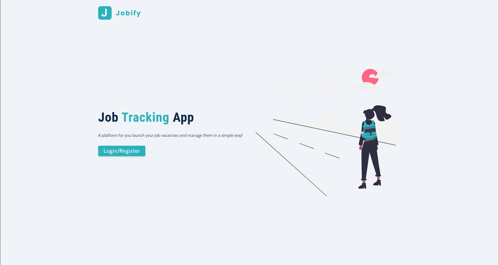
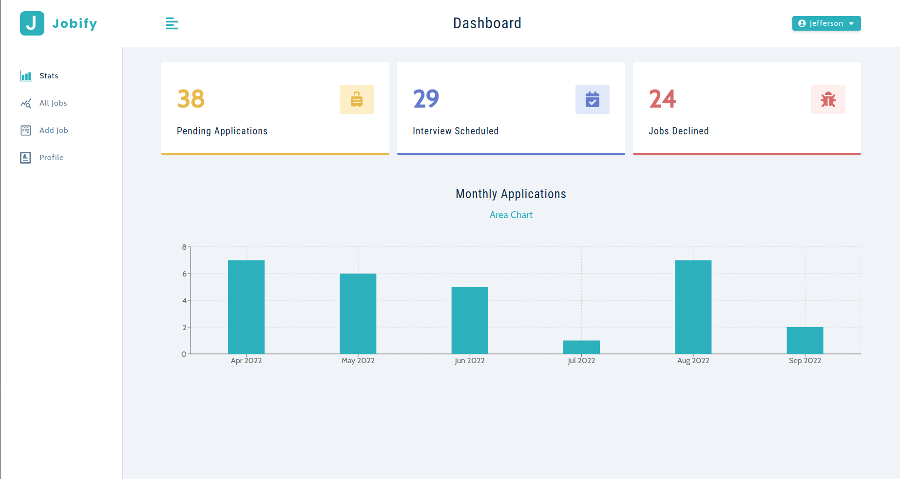
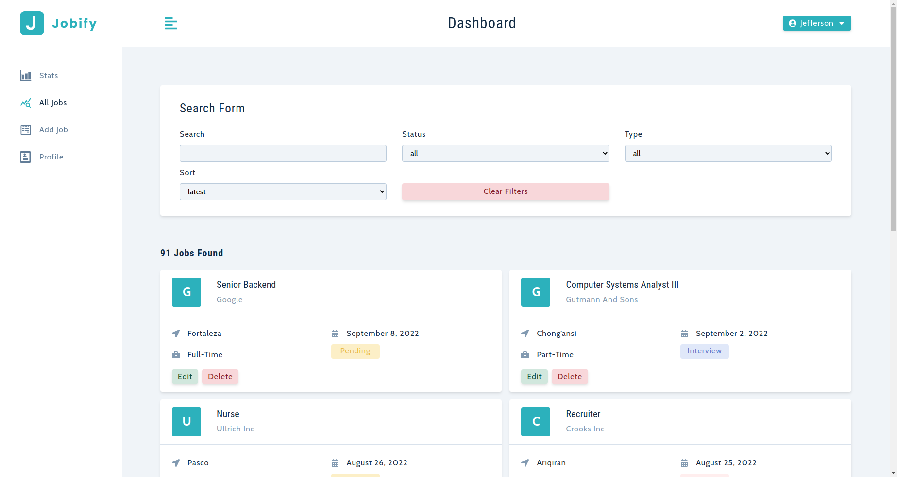

# <div align="center">Jobify</div>





## 🛠️ Tecnologias

<ul>
  <li><a href="https://reactjs.org/">React</a></li>
  <li><a href="https://nodejs.org/en/">Node</a></li>
  <li><a href="https://nodejs.org/en/">Express</a></li>
  <li><a href="https://nodejs.org/en/">MongoDB</a></li>
  <li><a href="https://nodejs.org/en/">Axios</a></li>
  <li><a href="https://nodejs.org/en/">JWT (Json Web Token)</a></li>
  <li><a href="https://nodejs.org/en/">React router dom</a></li>
  <li><a href="https://nodejs.org/en/">Context API</a></li>
</ul>
<br/>

## 🚀 Instalação

```
$ git clone https://github.com/jeffersonximeness/jobify

$ npm install
$ cd client && npm install
$ cd ../
$ npm start
```

## 💡 Sobre o projeto
<div>
    Jobify é uma aplicação de Job Tracking, ou seja, você pode registrar vagas de trabalhos que você aplicou e mudar o status dela, de acordo com o andamento da mesma. <br/>
    Além disso, a plataforma fornece um gráfico para que você acompanhe o panorama geral das suas aplicações, fornecendo o número de aplicações de acordo com o status (Pending, Interview e Declined) e quantas aplicações foram feitas nos últimos 6 meses.
</div>
